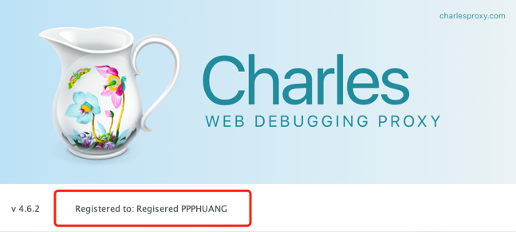

## Charles破解

> 本代码仅供学习交流，请支持正版

1. Charles未授权状态


2. 反编译Charles Jar包查看源码


由图可见`Charles`通过`showRegistrationStatus()`方法检查软件是否已经授权。
`p.a()`方法检验授权状态，授权的话展示授权名称，名称由`p.c()`方法获取。

3. 修改Charles关键字节码文件 修改思路：
    1. `p.a()`方法直接返回`true`。
    2. `p.c()`方法直接返回自己的注册名称。
    3. 将修改后的类生成`class`文件。

```java
package com.ppphuang.demo.charles;

public class Main1 {
    /**
     * 实例化类型池
     */
    public static ClassPool pool = ClassPool.getDefault();

    public static void main(String[] args) throws NotFoundException, CannotCompileException, IOException, ClassNotFoundException {
        // 获取默认类型池对象
        pool.insertClassPath("/Applications/Charles.app/Contents/Java/charles.jar");
        // 从类型池中读取指定类型
        CtClass oFTR = pool.get("com.xk72.charles.p");
        try {
            // 取得需要修改的方法
            CtMethod ctMethod = oFTR.getDeclaredMethod("a", null);
            // 修改方法体直接return true;
            ctMethod.setBody("{return true;}");
            ctMethod = oFTR.getDeclaredMethod("c", null);
            ctMethod.setBody("{return \"Regisered PPPHUANG\";}");
            //将上面构造好的类写入到指定的工作空间中
            oFTR.writeFile("/Users/ppphuang/Documents/code/java/src/main/java/com/ppphuang/demo/charles/");
        } catch (Exception e) {
            e.printStackTrace();
        }
    }
}

```

4. 用生成的Class文件替换Charles.Jar中的Class文件

`jar -uvf /Applications/Charles.app/Contents/Java/charles.jar com/xk72/charles/p.class`

5. 启动Charles

